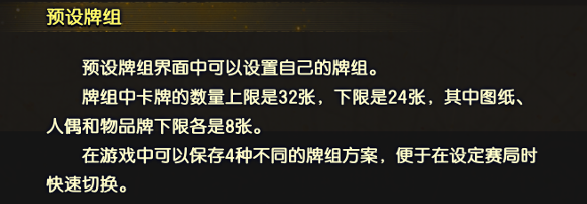
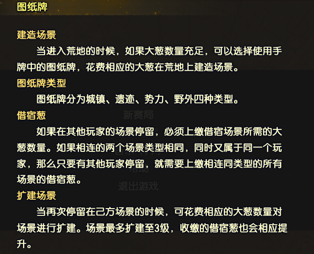
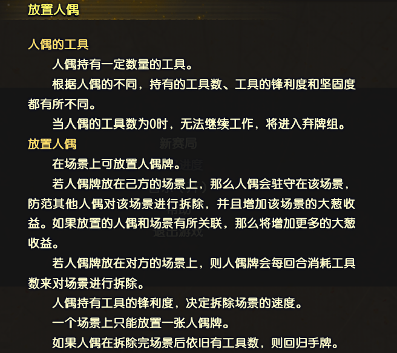
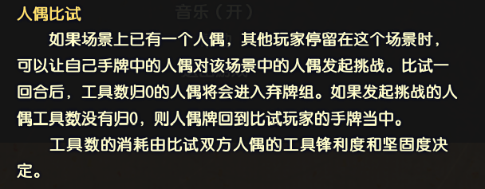
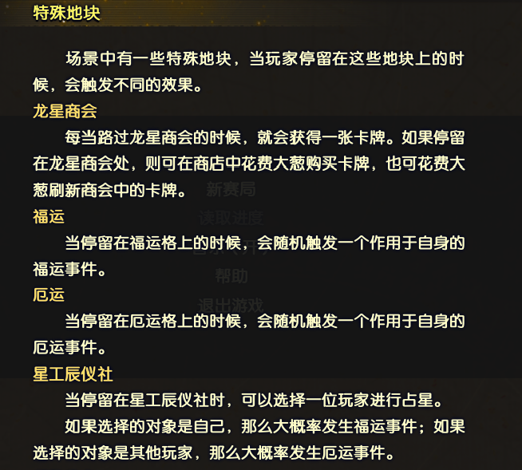
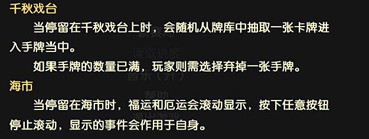
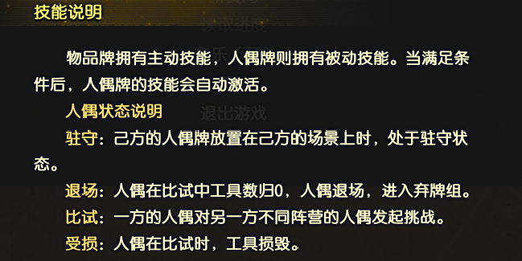

# 大葱奇谭

## 游戏简介

- 《古剑奇谭三》v1.2版本中，更新的两个独立小游戏之一

### 预设牌组

### 手牌

### 物品牌

- 昭明
 指定一名人偶工具锋利度+1

- 露草
 使用后立即抽2张牌

- 凤来
 指定一名玩家原地停留1回合

- 黑龙鳞片
 指定一名玩家随机损失2张牌

- 古剑焚寂
 指定一名人偶工具锋利度+1，若对象为**百里屠苏**，则+2

- 古剑红玉
 指定一名人偶工具锋利度+1，若对象为**红玉**，则+2

- 青玉司南佩
 使用后免除下一次厄运

- 焦炭
 指定一名人偶工具数-5

- 通天之器
 指定一张场上的卡牌，复制到手牌中

- 无名之剑
 指定一名人偶工具锋利度+1，若对象为**乐无异**，则+2

- 金麒麟
 免除下一次借宿葱

- 兔子抱枕
 指定一名人偶工具数+5

- 古剑晗光
 指定一名人偶工具锋利度+1，若对象为**乐无异**，则+2

- 百胜刀
 指定一处场景土木值-5

- 忘川
 指定一名人偶工具锋利度+1，若对象为**谢衣**，则+2

- 华月箜篌
 指定一名场上的人偶，回到其拥有者的手牌中

- 太岁
 指定一名人偶工具锋利度+1，若对象为**缙云**或**北洛**，则+2

- 画板
 指定一处场景土木值+5

- 半魂莲
 将下一次遭遇到的厄运嫁祸给指定玩家，此效果持续5回合

- 玉梳
 指定一名人偶工具牢固度+2，若对象为**司危**，则+3

- 梦魂枝
 指定下一次扑卖点数

- 青丘尘中记
 指定一名玩家与自己平分葱，若**刘兄**在手牌中，多获得10%葱

- 天鹿
 指定一名人偶工具锋利度+1，若对象为**北洛**或**玄戈&霓商**，则+2

### 图纸牌

- 琴川
 关联人偶：方兰生

- 长安
 关联人偶：乐无异

- 天墉城
 关联人偶：百里屠苏、陵越

- 百草谷
 关联人偶：闻人羽

- 巫山
 关联人偶：阿阮

- 蓬莱
 关联人偶：巽芳、欧阳少恭

- 青玉坛
 关联人偶：欧阳少恭

- 紫榕林
 关联人偶：襄铃

- 榣山
 关联人偶：悭臾、欧阳少恭

- 太华山
 关联人偶：清和真人、夏夷则

- 幽都
 关联人偶：风晴雪、尹千觞

- 流月城
 关联人偶：沈曦、谢衣、沈夜、华月

- 桃花谷
 关联人偶：风晴雪、百里屠苏

- 静水湖
 关联人偶：谢衣

- 安陆
 关联人偶：红玉

- 神女墓
 关联人偶：阿阮

- 鄢陵
 关联人偶：岑缨

- 天鹿城
 关联人偶：北洛、玄戈&霓商

- 西陵
 关联人偶：巫炤、司危、嫘祖

- 有熊
 关联人偶：姬轩辕、缙云

- 白梦泽
 关联人偶：云无月、缙云、北洛

- 巫之国
 关联人偶：北洛、刘兄

- 鼎湖
 关联人偶：姬轩辕、缙云、嫘祖

- 赤水
 关联人偶：姬轩辕、嫘祖、悭臾

- 阳平
 关联人偶：刘兄

- 无名之地
 关联人偶：巫炤、司危

- 红叶湖
 关联人偶：襄铃、百里屠苏

- 捐毒
 关联人偶：乐无异、谢衣、沈夜

### 人偶牌

|| 工具数 | 工具锋利度 | 工具牢固度|
| :------: | :------: | :------: | :------: | 
| 风晴雪 | 10 | 9 | 13 |
| 方兰生 | 7 | 6 | 12 | 
| 阿阮 | 7 | 7 | 14 | 
| 沈曦| 7 | 7 | 7 | 
| 巽芳 | 7 | 6 | 8 |
| 襄铃 | 9 | 6 | 12 | 
| 乐无异 | 11 | 11 | 12 | 
| 谢衣 | 10 | 12 | 13 | 
| 禺期 | 9 | 9 | 10 |
| 悭臾 | 11 | 9 | 18 | 
| 红玉 | 9 | 7 | 16 | 
| 尹千觞 | 10 | 5 | 15 | 
| 闻人羽 | 9 | 8 | 14 |
| 欧阳少恭 | 9 | 12 | 15 | 
| 清和真人 | 8 | 10 | 13 | 
| 夏夷则 | 9 | 9 | 13 | 
| 百里屠苏 | 10 | 10 | 18 | 
| 沈夜 | 10 | 11 | 17 |
| 陵越 | 10 | 10 | 12 | 
| 华月 | 9 | 10 | 14 | 
| 北洛 | 10 | 12 | 18 | 
| 云无月 | 11 | 11 | 17 |
| 岑缨 | 10 | 9 | 11 | 
| 姬轩辕 | 10 | 12 | 12 | 
| 缙云 | 8 | 10 | 19 | 
| 巫炤 | 9 | 11 | 18 |
| 司危 | 7 | 7 | 15 | 
| 玄戈&霓商 | 9 | 11 | 17 | 
| 嫘祖 | 10 | 10 | 12 | 
| 刘兄 | 8 | 7 | 7 |
| 馋鸡 | 6 | 5 | 17 | 
| 阿翔 | 7 | 6 | 13 | 

- 风晴雪 
 派遣时，每3回合附近2格地块内的己方人偶工具数+1

- 方兰生
 派遣时，经过此场景的玩家只可再前进1格地块

- 阿阮
 退场时，拥有者立即获得卡牌**露草**

- 沈曦
 派遣时，每3回合工具数、工具锋利度、工具牢固度均恢复到初始状态

- 巽芳
 退场时，拥有者立即获得卡牌**欧阳少恭**

- 襄铃
 比试时，扑卖阶段可投掷12枚铜钱

- 乐无异
 驻守时，每5回合场景规模+1级

- 谢衣
 驻守时，场内扩建所需的大葱-50%

- 禺期
 退场时，拥有者立即获得卡牌**无名之剑**

- 悭臾
 派遣时，每5回合其所在场景及附近2格地块内的场景土木值-5

- 红玉
 比试时必定先手

- 尹千觞
 退场时，随机进入场上一名玩家的手牌

- 闻人羽
 驻守**百草谷**时，工具锋利度+1，工具牢固度+1

- 欧阳少恭
 退场时，所有场景土木值-5

- 清和真人
 位于**太华山**时，每3回合大葱+100.与夏夷则比试时，工具锋利度-1

- 夏夷则
 退场时，有50%概率回到己方手牌，且工具数上限-3

- 百里屠苏
 工具数少于5时，工具锋利度+1

- 沈夜
 派遣时，每3回合工具锋利度+1，工具牢固度+1，工具数-1

- 陵越
 驻守**天墉城**时，工具锋利度+1.工具牢固度+1

- 华月
 退场时，拥有者立即获得卡牌**华月的箜篌**

- 北洛
 比试时，若一回合内无人偶退场，则再比试一回合

- 云无月
 派遣时，所有玩家每3回合大葱+100

- 岑缨
 奇数回合时，回避其他人偶的比试请求

- 姬轩辕
 驻守时，场景规模+1级，退场时，场景规模-1级

- 缙云
 比试结束时，若没有退场，则工具锋利度+1

- 巫炤
 退场时，所有玩家随机抽取1个厄运

- 司危
 比试结束时，若没有退场，则工具数+1

- 玄戈&霓商
 驻守**天鹿城**时，工具锋利度+1，工具锋利度+1，工具牢固度+1，工具数+1

- 嫘祖
 驻守**西陵**时，工具锋利度+1，工具牢固度+1

- 刘兄
 派遣时，每3回合从牌组中抽取1张卡牌

- 馋鸡
 工具数大于1时，比试过程中工具被一次性全毁后，会重新获得1个工具

- 阿翔
 比试时，有50%的概率避免工具受损

### 地仙扑卖

### 特殊地块

### 技能说明

### 当季折扣

